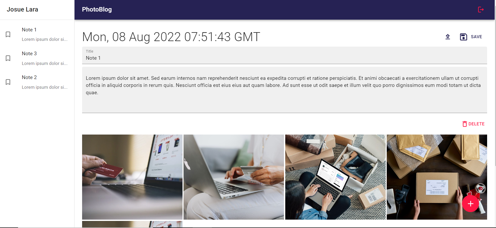

# PhotBlog App

Create notes with text/images, saved in cloudinary and firebase. React App created with vite.

Learning:

1. Use cloudinary to save images.
2. Use Sweetalert2 modals.
3. Set up and make Firebase, Cloudinary and Redux store tests with Jest and React Testing library.

<!-- # Deployment

VERCEL:

[LINK]() -->

## Screenshot

Desktop version:

Mobile version:

## Libraries and tools

1.  [React](https://en.reactjs.org/)
2.  [Vite](https://vitejs.dev/)
3.  [Redux Toolkit](https://redux-toolkit.js.org/)
4.  [React Redux](https://react-redux.js.org/introduction/getting-started)
5.  [React Router DOM](https://reactrouter.com/)
6.  [Material UI](https://mui.com/)
7.  [Sweetalert2](https://sweetalert2.github.io/)
8.  [Firebase](https://firebase.google.com/)
9.  [Cloudinary](https://cloudinary.com/)
10. [dotenv](https://www.dotenv.org/)
11. [Jest](https://jestjs.io/)
12. [Testing Library](https://testing-library.com/)

## Install and run project

1. Clone repo.
2. Make an account and a database to get api keys for production in [Firebase](https://firebase.google.com/).
3. Make another database in firebase to get api keys for testing.
4. Make an account and a database to get api keys for [Cloudinary](https://cloudinary.com/).
5. Check .env.example file and create `.env` and `.env.test` files with your keys.
6. Install modules `yarn install`.
7. Run project `yarn dev`.
8. Run tests `yarn test`.
